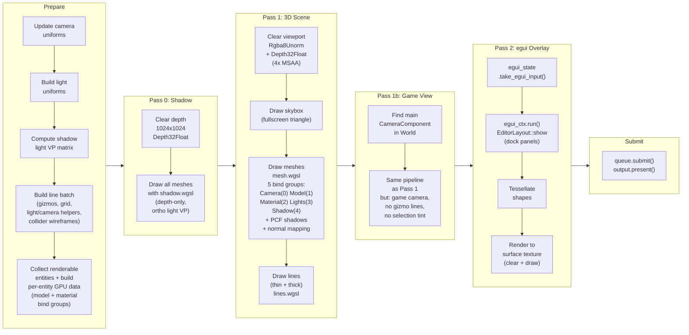

# ClawdEngine Architecture

## 1. Module Overview

The engine is composed of 8 modules orchestrated by a central `App` struct implementing winit's `ApplicationHandler`. Each module has a single responsibility and communicates through shared data structures.

| Module | Responsibility | Key Types |
|--------|---------------|-----------|
| **core** | ECS (entities, components, world) | `World`, `EntityId`, `Transform`, `Material`, `Light`, `RigidBody`, `Collider`, `CameraComponent` |
| **renderer** | GPU pipeline, 3D rendering, viewports | `GpuContext`, `SceneRenderer`, `MeshPipeline`, `LinePipeline`, `ShadowMap`, `SkyboxPipeline` |
| **editor** | UI panels, gizmos, shortcuts, layout | `EditorContext`, `EditorLayout`, `EditorTab`, `GizmoDragState` |
| **physics** | Collision detection, rigid body dynamics, raycasting | `PhysicsSystem`, `CollisionState`, `CollisionEvent`, `RayHit` |
| **scripting** | Trait-based game logic, script context | `GameScript` trait, `ScriptContext`, `ScriptRegistryEntry` |
| **input** | Keyboard + mouse state tracking | `Input` (physical keys + logical chars + mouse) |
| **assets** | Scene serialization, OBJ/glTF loading, project management | `scene`, `obj_loader`, `gltf_loader`, `ProjectSettings`, `paths` |
| **audio** | Spatial audio playback via rodio | `AudioSystem`, `AudioListener` pattern |

```mermaid
flowchart TB
    subgraph app["App (main.rs)"]
        direction LR
        APP["ApplicationHandler\nwinit event loop"]
    end

    subgraph core["core"]
        WORLD["World\n(SoA ECS)"]
        ENTITY["EntityId\n(u32 + generation)"]
        COMPONENTS["Components\nTransform, Material,\nLight, RigidBody,\nCollider, Camera,\nAudioSource, UiElement"]
    end

    subgraph renderer["renderer"]
        GPU["GpuContext\n(wgpu device/queue/surface)"]
        SCENE["SceneRenderer\n(pipeline, camera,\nmesh_store, shadows)"]
        MESH_PIPE["MeshPipeline\n(mesh.wgsl)"]
        LINE_PIPE["LinePipeline\n(lines.wgsl)"]
        SHADOW["ShadowMap\n(shadow.wgsl)"]
        SKYBOX["SkyboxPipeline\n(skybox.wgsl)"]
        VP["ViewportTexture\n(render-to-texture)"]
        TEXSTORE["TextureStore"]
    end

    subgraph editor["editor"]
        ECTX["EditorContext\n(selection, tools,\nundo, dock state)"]
        LAYOUT["EditorLayout\n(egui_dock tabs)"]
        PANELS["Panels\nHierarchy, Viewport,\nInspector, Assets,\nConsole, GameView,\nSettings"]
        GIZMO["GizmoInteraction"]
        PICK["Picking / Raycast"]
        SHORTCUTS["Shortcuts"]
    end

    subgraph physics["physics"]
        PHYS["PhysicsSystem\n(gravity, collision,\nground plane)"]
        RAYCAST["Raycast"]
    end

    subgraph scripting["scripting"]
        SCRIPT["GameScript trait\n(start / update)"]
        SCTX["ScriptContext\n(world, input, time,\ncollisions, raycast)"]
    end

    subgraph input["input"]
        INPUT["Input\n(keys, mouse,\nscroll, logical chars)"]
    end

    subgraph assets["assets"]
        ASSETS_SCENE["Scene\n(RON serialization)"]
        LOADERS["OBJ / glTF loaders"]
        SETTINGS["ProjectSettings"]
        PATHS["Asset path resolution"]
    end

    subgraph audio["audio"]
        AUDIO["AudioSystem\n(rodio sinks,\nspatial attenuation)"]
    end

    %% App owns everything
    APP --> WORLD
    APP --> GPU
    APP --> SCENE
    APP --> ECTX
    APP --> INPUT
    APP --> PHYS
    APP --> AUDIO

    %% Core dependencies (none -- leaf module)

    %% Renderer reads from core
    SCENE --> WORLD
    GPU --> SCENE

    %% Editor reads/writes core + renderer
    ECTX --> WORLD
    GIZMO --> WORLD
    GIZMO --> SCENE
    LAYOUT --> ECTX
    PANELS --> ECTX
    PICK --> RAYCAST

    %% Physics reads/writes core
    PHYS --> WORLD

    %% Scripting reads core + input + physics
    SCTX --> WORLD
    SCTX --> INPUT
    SCTX --> RAYCAST

    %% Assets reads/writes core + renderer
    ASSETS_SCENE --> WORLD
    LOADERS --> SCENE

    %% Audio reads core
    AUDIO --> WORLD

    %% Input is read by editor + scripting
    SHORTCUTS --> INPUT

    classDef modCore fill:#4B8BBE,stroke:#2A5A8E,color:#fff
    classDef modRenderer fill:#E06C75,stroke:#B04850,color:#fff
    classDef modEditor fill:#98C379,stroke:#6A9B4E,color:#000
    classDef modPhysics fill:#E5C07B,stroke:#B8993E,color:#000
    classDef modScript fill:#C678DD,stroke:#9A5AB0,color:#fff
    classDef modInput fill:#56B6C2,stroke:#3A8A94,color:#000
    classDef modAssets fill:#D19A66,stroke:#A57840,color:#000
    classDef modAudio fill:#F9E2AF,stroke:#C4B07A,color:#000

    class WORLD,ENTITY,COMPONENTS modCore
    class GPU,SCENE,MESH_PIPE,LINE_PIPE,SHADOW,SKYBOX,VP,TEXSTORE modRenderer
    class ECTX,LAYOUT,PANELS,GIZMO,PICK,SHORTCUTS modEditor
    class PHYS,RAYCAST modPhysics
    class SCRIPT,SCTX modScript
    class INPUT modInput
    class ASSETS_SCENE,LOADERS,SETTINGS,PATHS modAssets
    class AUDIO modAudio
```



## 2. Render Pipeline

Each frame, the GPU executes three sequential passes within a single command encoder. The 3D scene is rendered to an off-screen texture (`ViewportTexture` at `Rgba8Unorm`), which egui then displays as an image inside the dock panel.



### Bind Group Layout (5 groups)

| Group | Binding | Content | Shader Stage |
|-------|---------|---------|-------------|
| 0 | Camera | `view_proj`, `eye_position` | Vertex + Fragment |
| 1 | Model | `model` matrix, `selection_color` | Vertex + Fragment |
| 2 | Material | `albedo`, `roughness`, `metallic`, `emission`, albedo texture, sampler, normal map | Fragment |
| 3 | Lights | `ambient`, `count`, array of 4 `LightData` (position, color, direction, spot_params) | Fragment |
| 4 | Shadow | shadow depth texture, comparison sampler, `light_vp` matrix | Fragment |

## 3. Game Loop

The game loop is driven by winit's `RedrawRequested` event. All systems run sequentially on a single thread within `handle_redraw()`.

```mermaid
flowchart TD
    START(["RedrawRequested"]) --> FPS["Compute dt\nUpdate FPS counter"]

    FPS --> HUB_CHECK{"Is Project Hub\nshowing?"}
    HUB_CHECK -->|Yes| RESIZE
    HUB_CHECK -->|No| SHORTCUTS

    SHORTCUTS["Editor Shortcuts\nCmd+Z/Y undo/redo\nQ/W/E/R tool switch\nCmd+S save, Cmd+D duplicate\nF focus, Del delete"]

    SHORTCUTS --> CAMERA["Camera Controls\nRight-click orbit + WASD fly\nMiddle-click pan\nScroll zoom\nF focus on selection"]

    CAMERA --> GIZMO["Gizmo Interaction\nPick axis on click\nDrag to move/rotate/scale\nHover highlight"]

    GIZMO --> PLAY_CHECK{"Play mode?"}
    PLAY_CHECK -->|No| RESIZE
    PLAY_CHECK -->|Yes| PHYSICS

    PHYSICS["Physics Step\nGravity integration\nCollect collider AABBs\nBroad-phase N^2 detection\nBox/Sphere/Mixed contacts\nImpulse resolution\nPosition correction\nGround plane collision\nGenerate events"]

    PHYSICS --> AUDIO["Audio Update\nFind AudioListener\nStart/stop sinks\nSpatial attenuation\nVolume + pitch"]

    AUDIO --> SCRIPTS["Script Execution\nstart() on first frame\nupdate() each frame\nScriptContext provides:\n  world, input, time, dt,\n  collisions, raycast\nDeferred entity destroy"]

    SCRIPTS --> RESIZE

    RESIZE["Resize Viewports\nScene viewport\nGame viewport\n(match dock panel size)"]

    RESIZE --> RENDER["render_frame()\nShadow pass\n3D pass to texture\nGame view pass\negui overlay pass\nSubmit + present"]

    RENDER --> PENDING["Process Pending Ops\nSpawn entities\nDelete entities\nDuplicate\nReparent\nLoad/save scenes\nUndo/redo restore\nTexture assign\nScript attach/remove\nPlay mode toggle\nGame build"]

    PENDING --> CLEAR_COLLISION["Clear collision state\nif not playing"]

    CLEAR_COLLISION --> INPUT_CLEAR["input.begin_frame()\nClear per-frame\nkeys/mouse/scroll"]

    INPUT_CLEAR --> REDRAW["window.request_redraw()"]

    REDRAW --> START

    classDef system fill:#4B8BBE,stroke:#2A5A8E,color:#fff
    classDef check fill:#E5C07B,stroke:#B8993E,color:#000
    classDef render fill:#E06C75,stroke:#B04850,color:#fff
    classDef editor fill:#98C379,stroke:#6A9B4E,color:#000

    class FPS,INPUT_CLEAR system
    class HUB_CHECK,PLAY_CHECK check
    class RENDER,RESIZE render
    class SHORTCUTS,CAMERA,GIZMO,PENDING editor
    class PHYSICS,AUDIO,SCRIPTS system
```



### Data Flow Summary

```
winit events
    |
    v
Input (physical keys + logical chars + mouse state)
    |
    v
Editor Shortcuts --> EditorContext (tool, selection, pending ops)
    |
    v
Camera Controls --> SceneRenderer.camera (orbit, fly, pan, zoom)
    |
    v
Gizmo Interaction --> World transforms (move/rotate/scale selected)
    |
    v
Physics Step --> World (velocity, position, collision events)
    |
    v
Audio Update --> AudioSystem (sinks, spatial mix)
    |
    v
Script Execution --> World (arbitrary mutations via ScriptContext)
    |
    v
Render Frame:
    GpuContext reads World + SceneRenderer
    Shadow pass --> 3D pass --> Game pass --> egui pass
    |
    v
Pending Operations:
    EditorContext flags --> World + SceneRenderer mutations
    |
    v
Input cleared, request next frame
```
